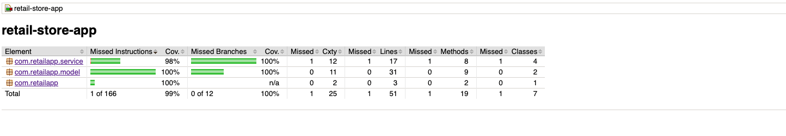

# Retail Store Discount Application

## Overview

This application calculates net payable amounts on a retail website based on various discount criteria. It follows an object-oriented programming approach and includes unit tests for good coverage.


## How to Run

1. **Build the Project**
    ```bash
    ./mvnw clean install
    ```

2. **Run Unit Tests**
    ```bash
    ./mvnw test
    ```

3. **Generate Coverage Report**
    ```bash
    ./mvnw jacoco:report
    ```

4. **Run SonarQube Analysis**
    ```bash
    ./mvnw sonar:sonar
    ```

## Project Structure

- `model` package contains the domain models.
- `service` package contains the discount strategy implementations.
- `test` package contains unit tests for the business logic.

## UML Diagram


## Code Coverage


## Future Scope of Development
- **Future Scope Features:**
   - Dynamic and configurable discount rules
   - Tiered discounts
   - Item-level discounts
   - Detailed billing breakdown
   - Role-Based Access Control (RBAC)
   - User profiles with membership levels and purchase history

- **Performance Enhancements:**
   - Caching mechanism
   - Microservices architecture for scalability

- **Testing and Quality Assurance:**
   - Comprehensive unit and integration tests
   - Continuous Integration/Continuous Deployment (CI/CD) pipeline
   - SonarQube integration for code quality monitoring